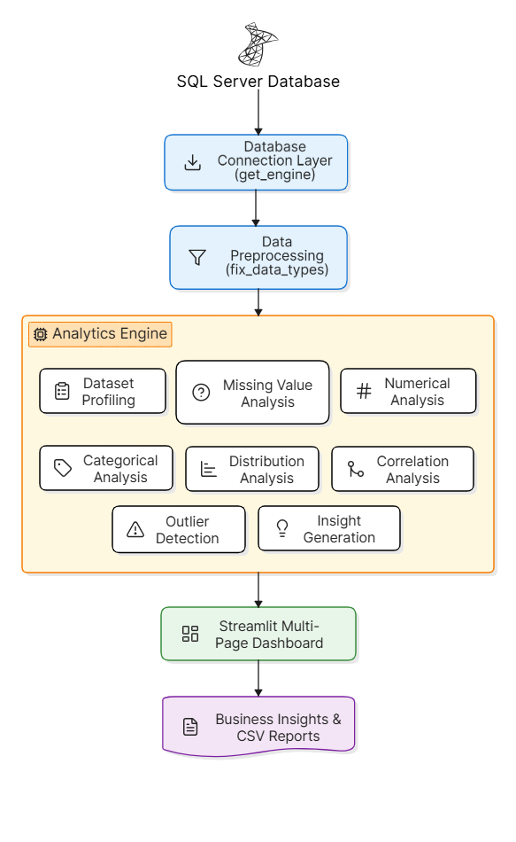
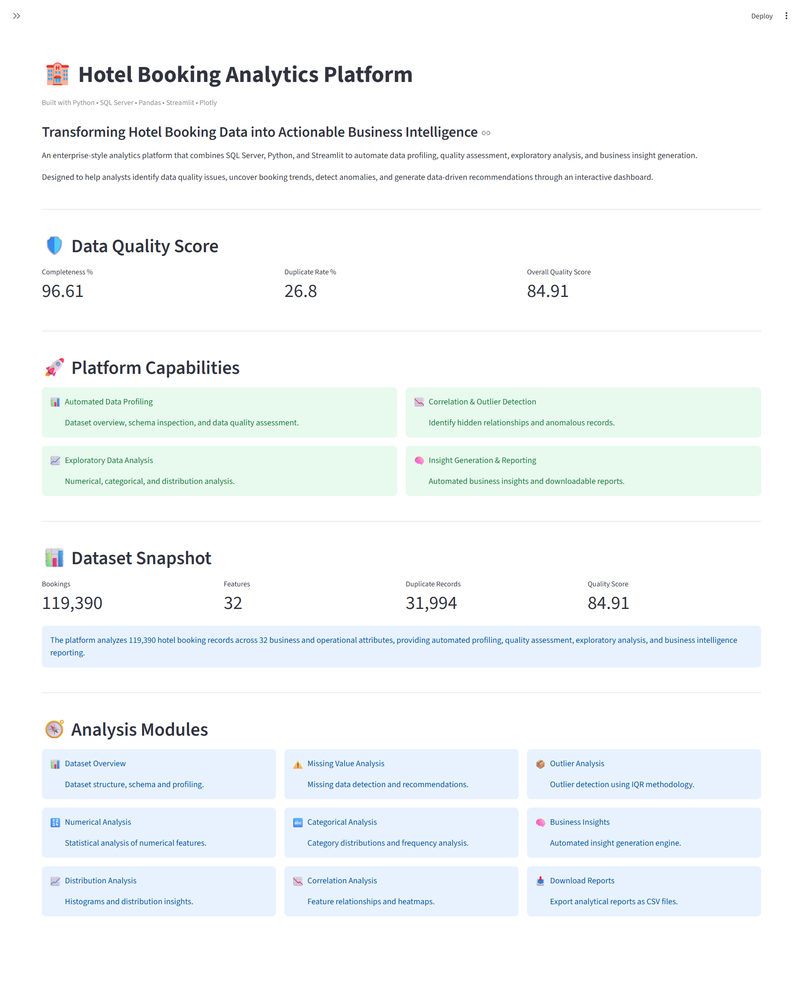
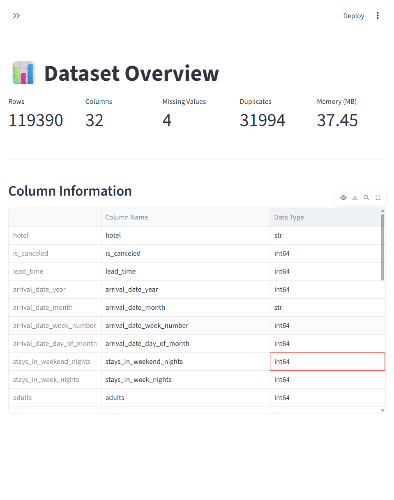
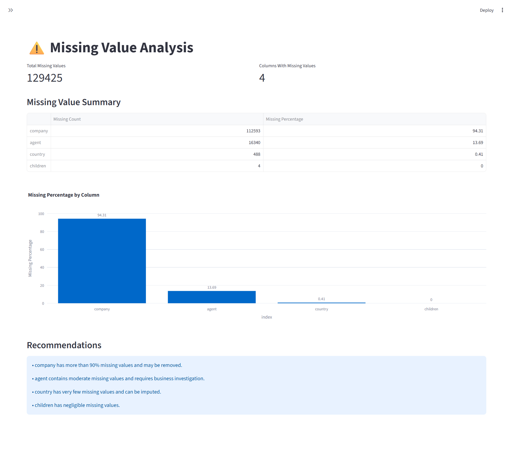
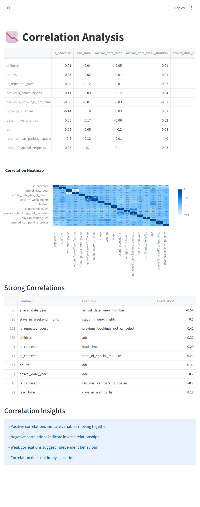
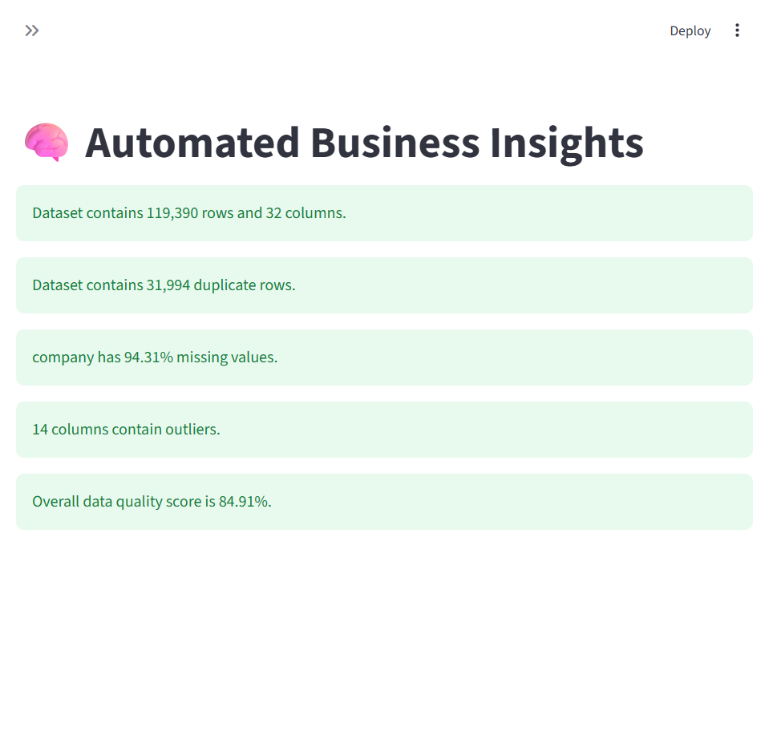

# 🏨 Hotel Booking Analytics Platform


[](https://hotel-booking-analytics-platform.streamlit.app/)

## 🌐 Live Demo

🚀 **Explore the deployed application:**
<https://hotel-booking-analytics-platform.streamlit.app/>

> **Note:** The deployed Streamlit application loads data from the included CSV dataset for cloud compatibility, while local development uses SQL Server as the primary data source.


> **Built as part of my Data Analytics Portfolio to demonstrate end-to-end data analysis, SQL integration, dashboard development, and business intelligence reporting.**


An end-to-end Hotel Booking Analytics platform built using Python, SQL Server, Streamlit, and Plotly that automates exploratory data analysis (EDA), data quality assessment, business insight generation, and interactive reporting through a multi-page dashboard.

---

## 📌 Problem Statement

Hotel booking datasets often contain missing values, duplicate records, outliers, and hidden relationships that make analysis time-consuming and error-prone.

This project automates the complete exploratory data analysis (EDA) workflow, enabling analysts to evaluate data quality, identify hidden patterns, detect anomalies, and generate actionable business insights through an interactive dashboard.

---

## 🚀 Key Features

* 📊 Automated Dataset Profiling
* ⚠️ Missing Value Analysis
* 🔢 Numerical Feature Analysis
* 🔤 Categorical Feature Analysis
* 📈 Distribution Analysis
* 📉 Correlation Analysis
* 📦 Outlier Detection (IQR Method)
* 🧠 Automated Business Insights
* 📥 CSV Report Downloads
* 🖥️ Interactive Multi-Page Streamlit Dashboard

---

## 📈 Business Value

This platform enables analysts and business users to:

* Improve data quality assessment through automated profiling.
* Detect missing values, duplicates, correlations, and outliers efficiently.
* Reduce manual exploratory data analysis (EDA) effort.
* Generate automated business insights to accelerate data-driven analysis.
* Support data-driven decision-making through interactive dashboards and downloadable reports.

---
## 🛠️ Technology Stack

| Category              | Technologies         |
| --------------------- | -------------------- |
| Programming Language  | Python               |
| Database              | SQL Server           |
| Data Processing       | Pandas, NumPy        |
| Data Visualization    | Plotly               |
| Dashboard             | Streamlit            |
| Database Connectivity | SQLAlchemy           |
| Development Tools     | VS Code, Git, GitHub |

---

## 📊 Dataset Information

| Attribute | Value                 |
| --------- | --------------------- |
| Dataset   | Hotel Bookings        |
| Records   | 119,390               |
| Features  | 32                    |
| Database  | SQL Server            |
| Domain    | Hospitality Analytics |


---

## 🏗️ System Architecture

The platform follows a modular architecture that separates data ingestion, preprocessing, analytical processing, visualization, and reporting into independent, reusable components.

**Hotel Booking Dataset → SQL Server → Database Connection Layer → Data Preprocessing → Analytics Engine → Streamlit Multi-Page Dashboard → Business Insights & CSV Reports**

> 📌 *Refer to the architecture diagram below for the complete workflow.*



The architecture separates data ingestion, preprocessing, analytics, visualization, and reporting into independent modules, improving maintainability, scalability, and code reusability.
---

## ⚙️ Project Workflow

1. Load the hotel booking dataset into SQL Server.
2. Establish a database connection using SQLAlchemy.
3. Preprocess and validate the dataset.
4. Perform automated exploratory data analysis (EDA).
5. Detect missing values, correlations, and outliers.
6. Generate automated business insights.
7. Present results through an interactive multi-page Streamlit dashboard.
8. Export analytical reports in CSV format.


---

## 📂 Project Structure

```text
hotel-booking-analytics-platform/
│
├── assets/
│   ├── architecture.png
│   └── screenshots/
│
├── config/
├── data/
├── docs/
├── modules/
├── pages/
├── reports/
├── sql/
├── tests/
├── utils/
│
├── app.py
├── requirements.txt
├── LICENSE
├── README.md
└── .gitignore
```

---

## 🚀 Installation & Setup

### 1. Clone the repository

```bash
git clone https://github.com/samruddhidhoke/Hotel-Booking-Analytics-Platform.git
```

### 2. Navigate to the project

```bash
cd Hotel-Booking-Analytics-Platform
```

### 3. Create a virtual environment

```bash
python -m venv venv
```

### 4. Activate the virtual environment

**Windows**

```bash
venv\Scripts\activate
```

### 5. Install dependencies

```bash
pip install -r requirements.txt
```

### 6. Run the application

```bash
streamlit run app.py
```

---

## 📸 Application Screenshots

### 🏠 Home Page



---

### 📊 Dataset Overview



---

### ⚠️ Missing Value Analysis



---

### 📉 Correlation Analysis



---

### 🧠 Business Insights



---


## 💡 Key Learnings

This project strengthened my understanding of:

* Building modular Python applications
* SQL Server integration using SQLAlchemy
* Data preprocessing and exploratory data analysis (EDA)
* Interactive dashboard development with Streamlit
* Data visualization using Plotly
* Rule-based business insight generation
* Git and GitHub project management
* Environment-aware application deployment using Streamlit Community Cloud

---

## 🔮 Future Enhancements

* AI-powered insights using Large Language Models (LLMs)
* PDF and Excel report generation
* Interactive dashboard filters
* Predictive analytics for booking cancellation
* Docker containerization
* Cloud database integration using Azure SQL or AWS RDS
* User authentication and role-based access
* Real-time KPI dashboard with live database synchronization

---

## 👨‍💻 Author

**Samruddhi Dhoke**

Computer Engineering Graduate | Aspiring Data Analyst & Data Scientist

- **GitHub:** <https://github.com/samruddhidhoke>
- **LinkedIn:** <https://linkedin.com/in/samruddhi--dhoke>

If you found this project useful, feel free to ⭐ this repository.
